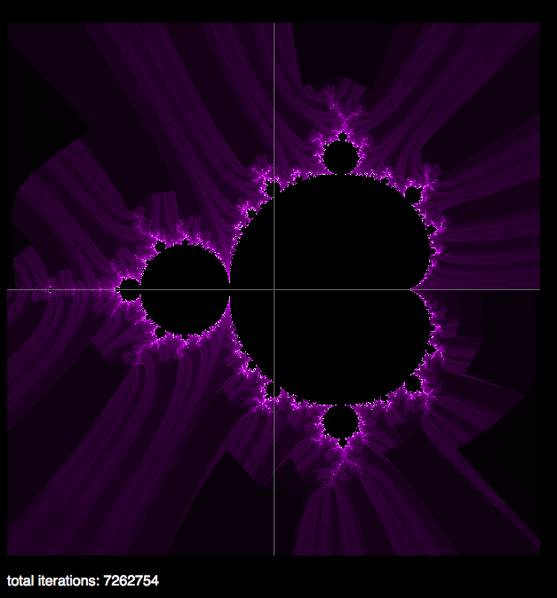

# OOJS Mandelbrot Set

A basic calculation and visualization of The Mandelbrot Set using Object-Oriented JavaScript.

[read about the making of and the tradeoffs of using OOJS](https://lombardo-chcg.github.io/search?term=mandelbrot) on my blog, Standard In

## Screenshot

## Credits
Credit to [Ashraff Hathibelagal](http://progur.com/2017/02/create-mandelbrot-fractal-javascript.html) for the HTML5 canvas help.
